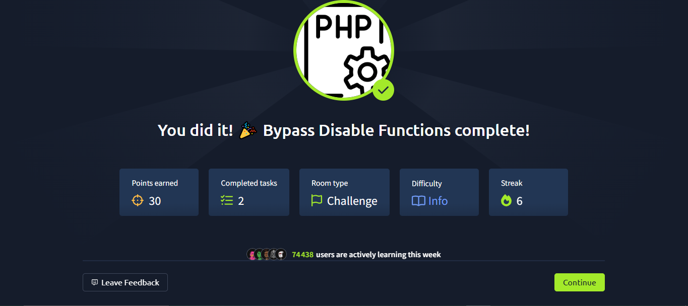

# TryHackMe - Bypass & Exploitation

## Introduction
Ce guide documente les techniques et scripts utilisés pour bypasser les restrictions et exploiter les failles sur les challenges TryHackMe. Il s’adresse aux pentesters et passionnés de CTF souhaitant automatiser et optimiser leurs attaques.

## Prérequis
- Système : Linux/WSL/Windows
- Outils : Python2/3, socat, netcat, gobuster, curl, nano
- Scripts fournis dans ce repo

## Étapes Principales
1. **Scan & Enumération**
   - Utilisation de `gobuster` avec un wordlist custom (`common.txt`) pour identifier les répertoires cachés.
2. **Upload & Contournement**
   - Test d’upload de fichiers (webshell, payloads) dans les répertoires accessibles.
   - Utilisation de Chankro pour générer un dropper PHP compatible avec les restrictions.
3. **Reverse Shell & Tunnel**
   - Mise en place d’un tunnel avec `socat` pour accéder au shell depuis Windows.
   - Lancement d’un listener avec `netcat`.
4. **Exploitation & Post-Exploitation**
   - Exécution du payload, stabilisation du shell, élévation de privilèges si possible.

## Scripts Utiles
- `exploit_ssh.sh` : Automatisation de l’exploitation SSH.
- `exploit_rootme.sh` : Workflow complet pour RootMe (scan, upload, tunnel, shell).
- `common.txt` : Wordlist optimisée pour l’énumération web.
- `tryhackme.php` : Dropper PHP généré par Chankro.

## Astuces de Contournement
- Vérifier le nom exact du fichier uploadé et le message de confirmation.
- Utiliser le bon binaire Python2 pour les outils legacy (ex : Chankro).
- Mettre en place un tunnel socat pour accéder aux services web internes.
- Adapter les payloads selon les restrictions (extension, contenu, obfuscation).

## Ressources
- [TryHackMe](https://tryhackme.com/)
- [Chankro](https://github.com/Al1ex/Chankro)
- [Gobuster](https://github.com/OJ/gobuster)
- [PayloadsAllTheThings](https://github.com/swisskyrepo/PayloadsAllTheThings)

## Auteur
Miicha333l

---
N’hésitez pas à adapter ce guide selon vos besoins et à partager vos astuces !
